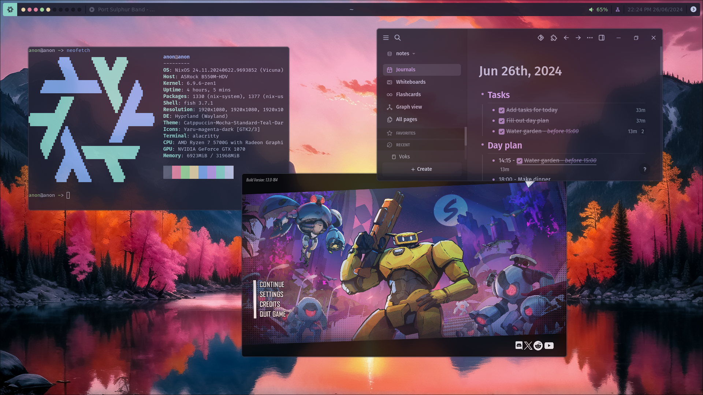

# Nixos configuration
My personal nixos config.



## Setup
You want to create a directory called nixos-flake in your home directory.
```
/home/myuser
└── nixos-flake/
    ├── nixos-config/
    ├── flake.nix
    ├── hardware-configuration.nix
    ├── home.nix
    └── system.nix
```

### nixos-config
This is where your clone of this repository lies.
```
git clone git@github.com:ChangeCaps/nixos-config.git
```

### flake.nix
This is pretty small file where you configure your ``username`` name and ``hostname``.
It should look something like this
```nix
{
  description = "NixOS configuration for anon"; 

  inputs = {
    nixos-config.url = "git+file:nixos-config";
  };

  outputs = { nixos-config, ... }: nixos-config.setup {
    home = ./home.nix;
    system = ./system.nix;
    username = "anon";
    hostname = "anon";
  };
}
```

### hardware-configuration.nix
This is your hardware configuration. Generate with
```bash
nixos-generate-config --show-hardware-config > hardware-configuration.nix
```

### home.nix
This is where you configure your home settings, this should contain only configuration specific to the system. All other changes should go in your nixos-config repository, so they can be synchronized with git. When you edit this file, run ``nh home switch``.

Here is a template for your ``home.nix``.
```nix
{ ... }: 

{
  # Which theme to use, select from base16.
  # https://github.com/tinted-theming/base16-schemes
  theme = "catppuccin-mocha";

  # The path to your nixos-flake.
  flake = "~/nixos-flake";

  # The monitor configuration.
  monitors = [
    {
      # The monitors name use `hyprctl monitors` to see available monitors.
      name = "DP-1"; 

      # Optional resolution.
      resolution = "1920";

      # Optional refresh rate.
      refreshRate = 60;

      # Optional position.
      position = "0x0";

      # Scale applied to the monitor.
      scale = 1.0;

      # Whether to enable the monitor.
      enable = true; 

      # The workspace on the monitor when hyprland starts.
      workspace = 1; 
    }
  ];

  # Git configuration.
  git = {
    userName = "John Doe";
    userEmail = "john.doe@example.org";
  };
}
```

### system.nix
This is where you configure your system settings. Same idea as with ``home.nix``, put as few things as possible in here. When you edit this file, run ``nh os switch``.

```nix
{ ... }:

{
  # Include the results of the hardware scan.
  imports = [ 
    ./hardware-configuration.nix
  ];

  # Enable if you have an Nvidia graphics card.
  nvidia.enable = true; 
}
```
